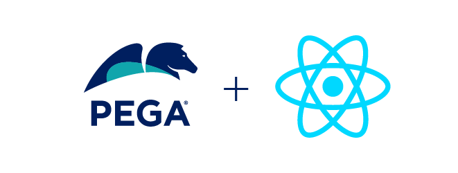

# React SDK Components

The **React SDK Components** repo provides the Pega [**React SDK**](https://github.com/pegasystems/react-sdk) with an
npm package containing the **bridge** to the ConstellationJS Engine and the default **components** on which clients
can modify, replace, or add components to suit their specific needs.

 

# Normal workflow

1.  **npm run ci** - cleans up all generated files from previous use and 
installs all of the npm packages needed

1.  **npm run build:dev** - runs lint and a development build

1.  **npm run start-dev** - starts a development server (with live reload)

1.  **Work in VS Code** - live reload should allow you to see changes in browser

1.  Once you're ready to build a new packaging of the SDK components.  
**npm run build-sdk** - compiles all of the necessary code and puts the contents of the npm packaging in **packages/react-sdk-components/lib**

1.  Then, when you want to create the .tgz file,  
**npm run pack-sdk** - creates the .tgz file of the compiled code in **packages/react-sdk-components/lib**

 

 
_more later..._